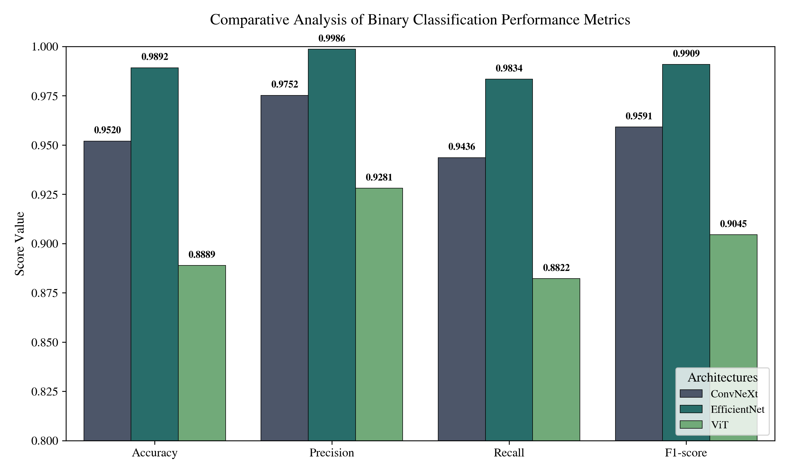
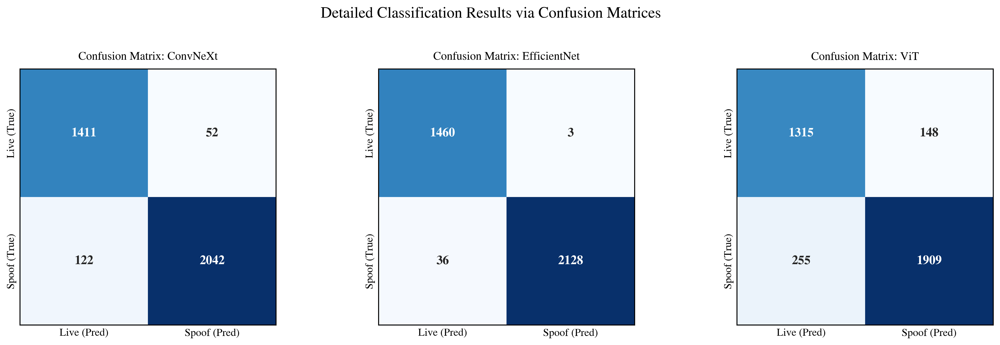
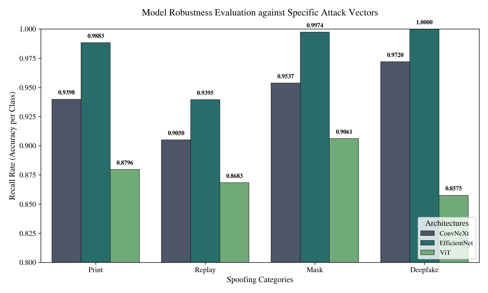
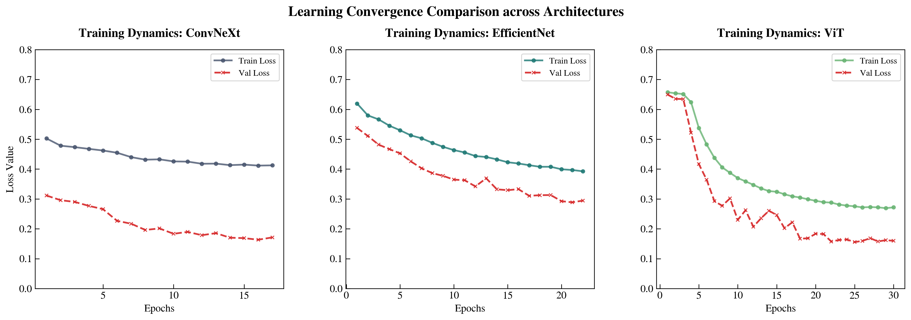
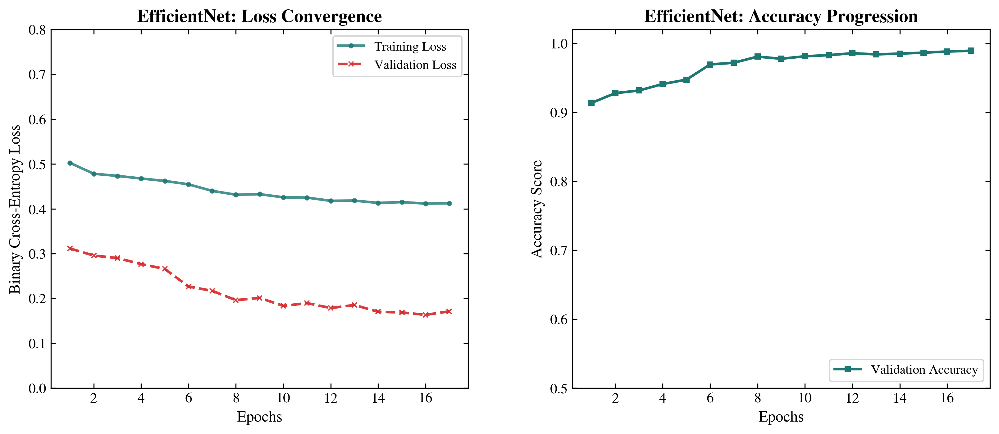
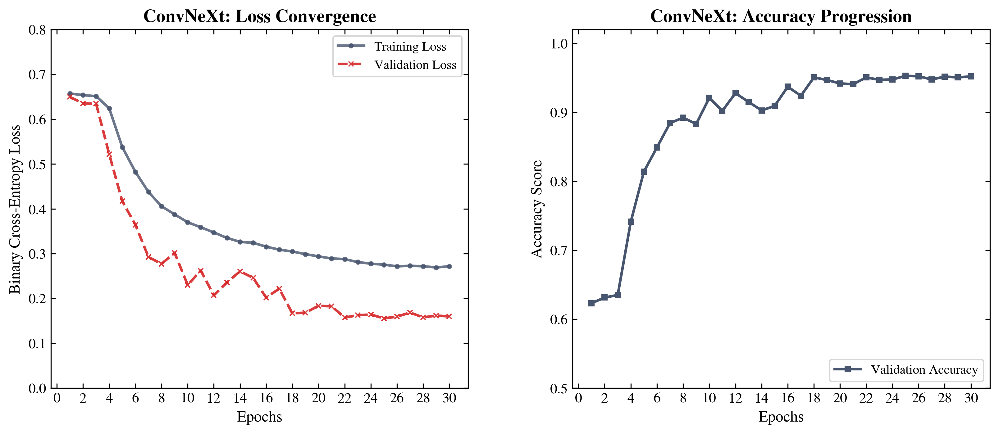
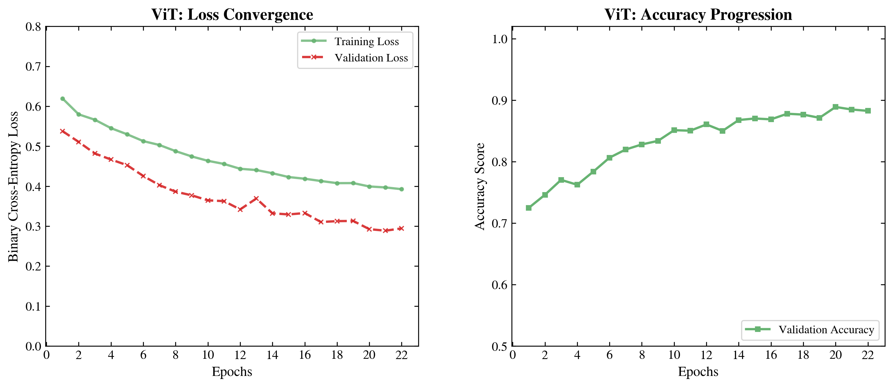

<div align="center">

# Face Anti-Spoofing

### Hệ thống phát hiện khuôn mặt thật và giả mạo bằng Deep Learning

Dự án so sánh **EfficientNet-V2-B0, ConvNeXt-Tiny và ViT-Base + LoRA** trên cùng một pipeline nhằm phát hiện các hình thức giả mạo như Print, Replay, 3D Mask và Deepfake.

[Kết quả](#kết-quả-thực-nghiệm) · [Kiến trúc](#pipeline-và-kiến-trúc) · [Dữ liệu](#dữ-liệu) · [Cài đặt](#cài-đặt) · [Demo](#demo) · [Hướng phát triển](#hướng-phát-triển)

<br>


</div>

---

## Tổng quan

Face Anti-Spoofing là hệ thống phân loại nhị phân giữa:

- **Live:** khuôn mặt thật
- **Spoof:** khuôn mặt giả mạo

Hệ thống hướng tới việc bảo vệ các giải pháp xác thực khuôn mặt trước bốn nhóm tấn công chính:

```text
Print Attack
Replay Attack
3D Mask Attack
Deepfake Attack
```

Dự án được thực hiện theo hướng nghiên cứu so sánh công bằng nhiều backbone hiện đại trong cùng một pipeline dữ liệu, huấn luyện và đánh giá.

---

## Điểm nổi bật

- So sánh ba kiến trúc Deep Learning trên cùng dữ liệu và head phân loại
- Xây dựng tập dữ liệu hơn 48.000 mẫu từ nhiều nguồn
- Làm sạch dữ liệu bằng face detection, duplicate removal và quality filtering
- Chia dữ liệu theo danh tính để tránh data leakage
- Áp dụng LoRA cho Vision Transformer
- Sử dụng Mixup, label smoothing và progressive unfreezing
- Đánh giá riêng theo từng loại tấn công
- Xây dựng demo Streamlit cho ảnh, webcam và video
- Lưu đầy đủ biểu đồ training, confusion matrix và báo cáo thực nghiệm

---

## Pipeline và kiến trúc

### Data Pipeline

<div align="center">


</div>

Pipeline dữ liệu tổng quát:

```text
Nguồn dữ liệu
    ↓
Phát hiện và crop khuôn mặt bằng MTCNN
    ↓
Loại ảnh lỗi và ảnh chất lượng thấp
    ↓
pHash Duplicate Removal
    ↓
Chuẩn hóa nhãn Live / Spoof
    ↓
Cân bằng domain và loại tấn công
    ↓
Split theo danh tính
    ↓
Train / Validation / Test
```

### EfficientNet-V2-B0

<div align="center">


</div>

### ConvNeXt-Tiny

<div align="center">


</div>

### ViT-Base + LoRA

<div align="center">


</div>

---

## Mô hình

### EfficientNet-V2-B0

- Khoảng 8,4 triệu tham số
- Kiến trúc gọn nhẹ
- Tốc độ inference tốt
- Phù hợp triển khai edge
- Đạt kết quả cao nhất trong ba mô hình

### ConvNeXt-Tiny

- Kiến trúc CNN hiện đại
- Khả năng học đặc trưng mạnh
- Hiệu quả tốt trên dữ liệu đa miền
- Chi phí tính toán cao hơn EfficientNet

### ViT-Base + LoRA

- Backbone Vision Transformer
- Fine-tuning bằng LoRA
- Rank: 16
- Alpha: 32
- Giảm trainable parameters từ khoảng 86 triệu xuống còn khoảng 0,6 triệu

---

## Dữ liệu

Dữ liệu được tổng hợp từ nhiều nguồn quốc tế:

| Nguồn | Loại dữ liệu | Vai trò |
|---|---|---|
| FFHQ | Live | Đa dạng danh tính và chất lượng ảnh |
| VGGFace2 | Live | Đa dạng góc nhìn, ánh sáng và biểu cảm |
| CelebA-Spoof | Print, Replay, Mask | Benchmark Face Anti-Spoofing |
| FaceForensics++ | Deepfake | Face2Face, FaceSwap và các phương pháp giả mạo |
| iBeta PAD Level 2 | 3D Mask | Dữ liệu mask chất lượng cao |
| Silicone Mask Dataset | Silicone Mask | Bổ sung dữ liệu mask thực tế |

Sau quá trình deep cleaning:

```text
Tổng số mẫu: 48.074
Train/Test split: 80/20
Phương pháp split: Subject-independent
Test set: 3.627 mẫu
```

### Subject-independent split

Ảnh của cùng một danh tính chỉ xuất hiện trong một tập dữ liệu duy nhất.

Cách chia này giúp:

- Hạn chế data leakage
- Đánh giá khả năng tổng quát hóa
- Tránh việc model ghi nhớ khuôn mặt
- Phản ánh chính xác hơn hiệu quả thực tế

---

## Kỹ thuật tiền xử lý

- MTCNN face detection
- Face alignment và crop
- pHash duplicate detection
- JPEG compression augmentation
- Gaussian blur augmentation
- Resize và normalization
- Domain balancing
- Attack-type balancing
- Quality filtering

---

## Kỹ thuật huấn luyện

- WeightedRandomSampler
- Mixup
- Label smoothing
- Progressive unfreezing
- Early stopping
- Learning-rate scheduling
- Transfer learning
- LoRA fine-tuning
- Data augmentation

---

## Kết quả thực nghiệm

### So sánh ba mô hình

| Backbone | Accuracy | F1-Score | False Positive | False Negative |
|---|---:|---:|---:|---:|
| **EfficientNet-V2-B0** | **99,07%** | **99,09%** | **0,21%** | **1,66%** |
| ConvNeXt-Tiny | 94,85% | 95,91% | 3,55% | 5,64% |
| ViT-Base + LoRA | 87,11% | 90,45% | 10,12% | 11,78% |

### Mô hình tốt nhất

EfficientNet-V2-B0 đạt:

```text
Accuracy: 99,07%
F1-Score: 99,09%
Precision: 99,86%
Deepfake detection: 100%
3D Mask detection: 99,74%
Parameters: 8,4M
```

Kết quả cho thấy EfficientNet-V2-B0 đạt cân bằng tốt giữa:

- Độ chính xác
- Số lượng tham số
- Tốc độ inference
- Khả năng triển khai thực tế

---

## Biểu đồ kết quả

### So sánh metrics

<div align="center">



</div>

### Confusion matrices

<div align="center">



</div>

### Phân tích theo loại tấn công

<div align="center">



</div>

### Loss curves

<div align="center">



</div>

### Training reports

<div align="center">





</div>

---

## Demo

Hệ thống hỗ trợ ba loại đầu vào:

- Ảnh
- Webcam
- Video

Chạy ứng dụng:

```bash
streamlit run app.py
```

Ứng dụng sẽ mở tại:

```text
http://localhost:8501
```

---

## Công nghệ sử dụng

| Nhóm | Công nghệ |
|---|---|
| Ngôn ngữ | Python |
| Deep Learning | PyTorch |
| Backbones | EfficientNet-V2, ConvNeXt, Vision Transformer |
| Efficient Fine-tuning | LoRA |
| Face Detection | MTCNN |
| Computer Vision | OpenCV, Pillow |
| Data Processing | NumPy, Pandas |
| Evaluation | Scikit-learn, Matplotlib |
| Demo | Streamlit |
| Configuration | YAML |
| Hardware | NVIDIA RTX 3060 Ti, CUDA 12.1 |
| Hệ điều hành | Ubuntu 22.04 |

---

## Cấu trúc dự án

```text
Face-anti-spoofing/
├── config/                 # Cấu hình huấn luyện
├── results/
│   ├── pipeline/           # Sơ đồ pipeline
│   ├── Attack_Analysis_LaTeX.png
│   ├── Confusion_Matrices_LaTeX.png
│   ├── Loss_Curves_Comparison.png
│   ├── Metrics_Comparison_LaTeX.png
│   ├── Training_Report_ConvNeXt.png
│   ├── Training_Report_EfficientNet.png
│   └── Training_Report_ViT.png
├── scripts/                # Script hỗ trợ
├── src/
│   ├── evaluation/         # Đánh giá mô hình
│   ├── inference/          # Inference pipeline
│   ├── models/             # Định nghĩa model
│   ├── training/           # Training pipeline
│   └── utils/              # Tiện ích
├── app.py                  # Streamlit application
├── demo_app.py             # Demo phụ
├── main.py                 # Entry point
├── requirements.txt
└── README.md
```

---

## Cài đặt

### 1. Clone repository

```bash
git clone https://github.com/vanujiash9/Face-anti-spoofing.git
cd Face-anti-spoofing
```

### 2. Tạo môi trường ảo

```bash
python -m venv .venv
```

Windows:

```bash
.venv\Scripts\activate
```

Linux hoặc macOS:

```bash
source .venv/bin/activate
```

### 3. Cài đặt thư viện

```bash
python -m pip install --upgrade pip
pip install -r requirements.txt
```

---

## Huấn luyện

### EfficientNet-V2-B0

```bash
python src/training/train_efficientnet.py --config config/efficientnet.yaml
```

### ConvNeXt-Tiny

```bash
python src/training/train_convnext.py --config config/convnext.yaml
```

### ViT-Base + LoRA

```bash
python src/training/train_vit.py --config config/vit.yaml
```

> Tên script cần khớp với source thực tế trong thư mục `src/training`.

---

## Đánh giá

Chạy đánh giá toàn bộ mô hình:

```bash
python evaluate_all.py
```

Nếu repository sử dụng script khác, kiểm tra thư mục:

```text
src/evaluation/
```

Các metric chính:

- Accuracy
- Precision
- Recall
- F1-score
- False Positive Rate
- False Negative Rate
- Confusion Matrix
- Attack-wise Accuracy

---

## Inference

Có thể chạy inference bằng:

```bash
python main.py
```

Hoặc sử dụng các script trong:

```text
src/inference/
```

Đầu vào hỗ trợ:

- Ảnh
- Webcam
- Video

Đầu ra:

```text
Live
Spoof
Confidence score
Attack type analysis
```

---

## Điểm nổi bật kỹ thuật

- So sánh công bằng ba backbone hiện đại
- Dataset đa nguồn và đa kiểu tấn công
- Subject-independent split
- Deep cleaning và duplicate removal
- LoRA fine-tuning cho Vision Transformer
- Training tricks giúp tăng độ ổn định
- Đánh giá chi tiết theo từng loại tấn công
- Demo ảnh, webcam và video
- EfficientNet phù hợp triển khai edge
- Pipeline đầy đủ từ dữ liệu đến ứng dụng

---

## Hạn chế hiện tại

- Dữ liệu vẫn có thể khác biệt với môi trường triển khai thực tế
- Chưa đánh giá cross-dataset đầy đủ
- Chưa thử nghiệm trên thiết bị edge thực tế
- ViT-Base có hiệu quả thấp hơn hai CNN backbone
- Chưa có REST API
- Chưa có Dockerfile
- Chưa có CI/CD
- Chưa công bố latency theo từng thiết bị
- Chưa có mô hình chống tấn công chưa từng thấy

---

## Hướng phát triển

- [ ] Đánh giá cross-dataset
- [ ] Kiểm thử với spoof attack chưa xuất hiện trong training
- [ ] Tối ưu ONNX hoặc TensorRT
- [ ] Quantization INT8 hoặc FP16
- [ ] Triển khai trên edge device
- [ ] Xây dựng FastAPI backend
- [ ] Docker hóa ứng dụng
- [ ] Bổ sung CI/CD
- [ ] Đo latency và throughput
- [ ] Thêm Grad-CAM để giải thích mô hình
- [ ] Thử nghiệm temporal modeling cho video
- [ ] Bổ sung face quality assessment
- [ ] Đánh giá theo ISO/IEC 30107-3

---

## Thông tin luận văn

- **Sinh viên:** Bùi Thị Thanh Vân
- **MSSV:** 2251320039
- **Ngành:** Công nghệ Thông tin – Khoa học Dữ liệu
- **Trường:** Đại học Giao thông Vận tải TP.HCM
- **Giảng viên hướng dẫn:** TS. Nguyễn Thị Khánh Tiên

---

## Tác giả

**Bùi Thị Thanh Vân**

- GitHub: [@vanujiash9](https://github.com/vanujiash9)
- Email: thanh.van19062004@gmail.com

---

<div align="center">

Được xây dựng bằng **Python, PyTorch, EfficientNet, ConvNeXt, Vision Transformer và Streamlit**.

Nếu dự án hữu ích, hãy để lại một ⭐ để ủng hộ.

</div>

